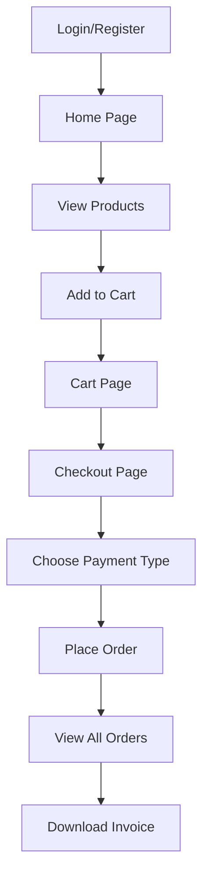

# 🛒 eCommerce Angular Application

A complete eCommerce frontend built with **Angular 17** and **TailwindCSS**, offering modern UI, real-world features, and a live production deployment.

🔗 **Live Demo**: [freshcarteco.netlify.app](https://freshcarteco.netlify.app/login)  
📂 **Source Code**: [GitHub Repository](https://github.com/muhammed-alateeqi1/eCommerceAngular)

---

## 🚀 Features

- 👤 **User Authentication** (Login/Register/Forgot Password)
- 🛍️ **Browse Products** with filters (categories, brands, prices)
- 🔍 **Product Details** with real-time rating display
- 🧾 **Cart System** with quantity controls and total cost
- 💳 **Checkout Process** supporting:
  - 🔘 Cash on delivery
  - 💸 Online payment
  - 💳 Credit Card form with validation (Strip)
- 📦 **Orders Management**:
  - ✅ View all past orders
  - 📄 View and download **electronic invoice**
- 📚 **Categories & Brands Management**
- 🔐 Auth-Guarded routes
- 📲 Fully Responsive across all screen sizes

---

## 🧰 Tech Stack

- **Framework**: Angular 17 (Standalone Components)
- **Styling**: TailwindCSS
- **Routing**: Angular Router + Guards
- **State Management**: BehaviorSubject
- **Authentication**: JWT (JSON Web Token)
- **PDF Invoice**: Auto-generated downloadable invoice
- **Payment**: Integration with payment API (Cash + Card + Online)

---

## ⚙️ Control Flow Summary

💡 How to Run Locally
git clone https://github.com/muhammed-alateeqi1/eCommerceAngular.git
cd eCommerceAngular
npm install
ng serve -o

